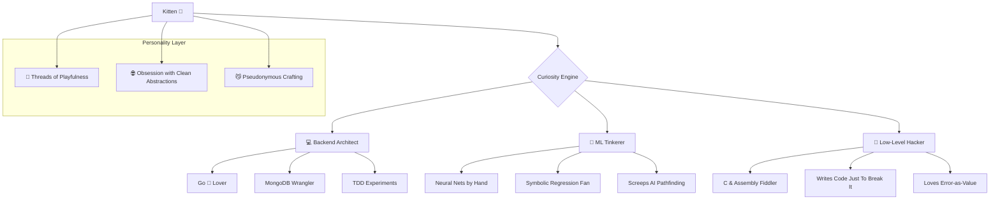

```mermaid
graph TD
    A[Kitten 🐾] --> B{Curiosity Engine}
    B --> C[💻 Backend Architect]
    B --> D[🧠 ML Tinkerer]
    B --> E[🧰 Low-Level Hacker]
    C --> C1[Go 🦫 Lover]
    C --> C2[MongoDB Wrangler]
    C --> C3[TDD Experiments]
    D --> D1[Neural Nets by Hand]
    D --> D2[Symbolic Regression Fan]
    D --> D3[Screeps AI Pathfinding]
    E --> E1[C & Assembly Fiddler]
    E --> E2[Writes Code Just To Break It]
    E --> E3[Loves Error-as-Value]

    subgraph Personality Layer
        F[🧵 Threads of Playfulness]
        G[🤓 Obsession with Clean Abstractions]
        H[😼 Pseudonymous Crafting]
    end

    A --> F
    A --> G
    A --> H
```
